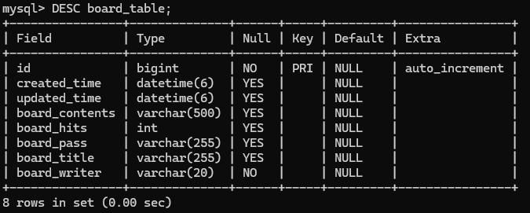
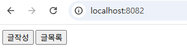
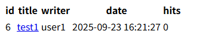
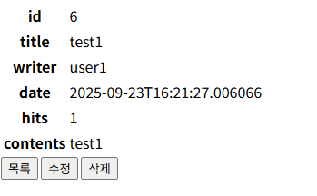
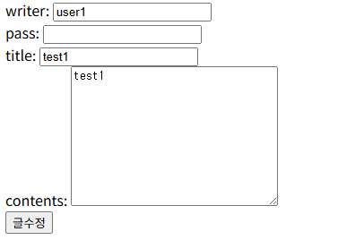

# CRUD 게시만 프로젝트

## 프로젝트 설명
글쓰기(Create), 글 조회 (Read), 글 수정(Update), 글 삭제(Delete) 기능을 구현한 프로젝트

### 게시판 주요 기능
1. 글쓰기: /board/save
2. 글목록: /board/
3. 글조회: /board/{id}
4. 글수정: /board/update/{id}
    - 상세 화면에서 수정 버튼 클릭
    - 서버에서 해당 게시글의 정보를 가지고 수정 화면 출력
    - 제목, 내용 수정 입력 받아서 서버로 요청
    - 수정 처리
5. 글삭제: /board/delete/{id}
6. 페이징처리(/board/paging)
    - /board/paging?page=2 -> 쿼리 파라미터 형식으로 페이지 번호 입력받을 것

### 개발 환경
1. IDE: IntelliJ IDEA Community
2. Spring boot 3.5.5
3. JDK 24
4. mysql
5. Spring Data JPA
6. Thymeleaf

---

## 데이터베이스 구조

* id : 게시글 id
* create_time: 작성한 시간
* update_time: 수정된 시간
* board_contents: 글 내용
* board_hits: 게시글 조회수
* board_pass: 글 비밀번호
* board_title: 글 제목
* board_writer: 작성자

## 페이지 화면
(UI 디자인은 따로 구현하지 않음)

### 1. 시작 화면

### 2. 글 목록 페이지

### 3. 글 작성 페이지

### 4. 글 조회 페이지

### 5. 글 수정 페이지

